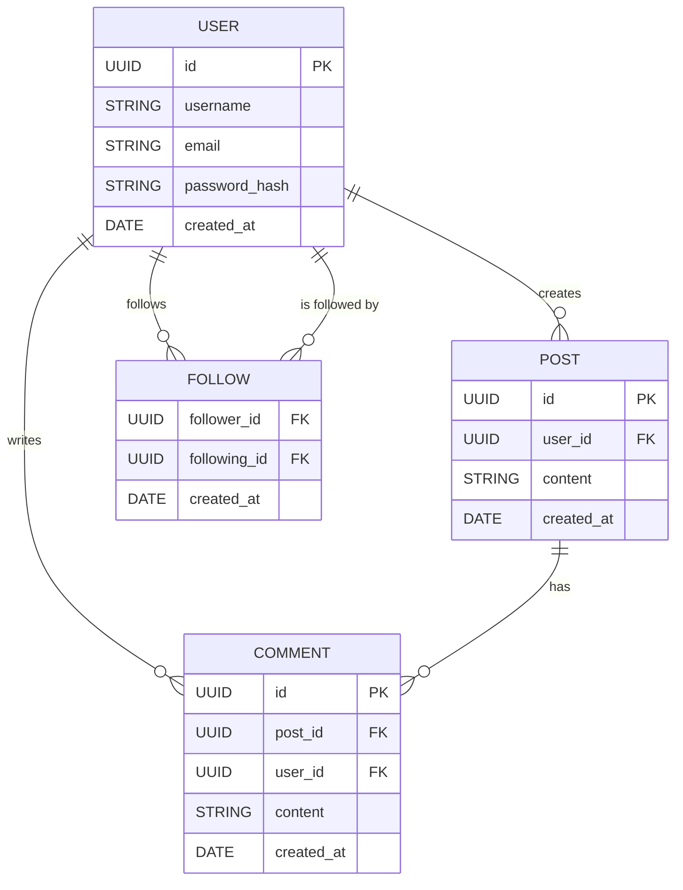
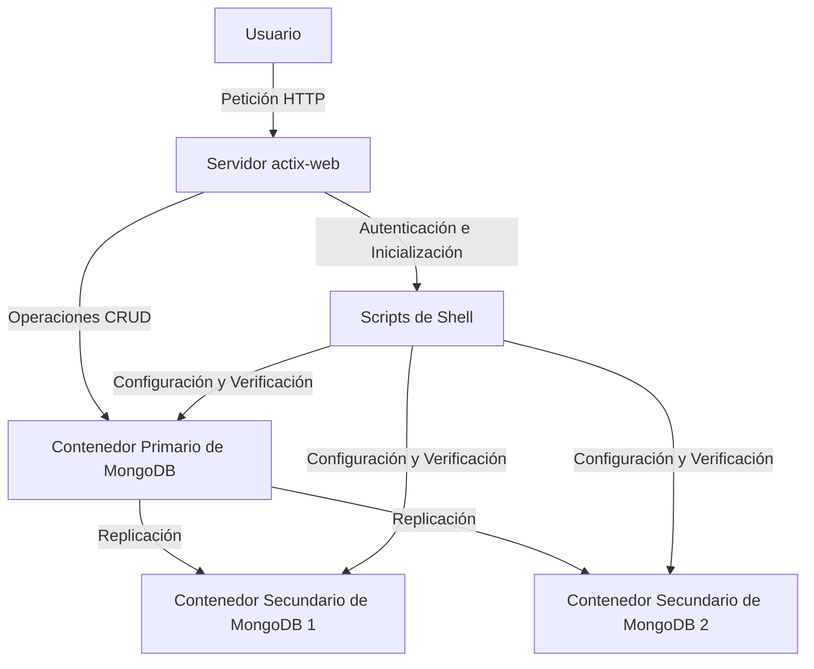
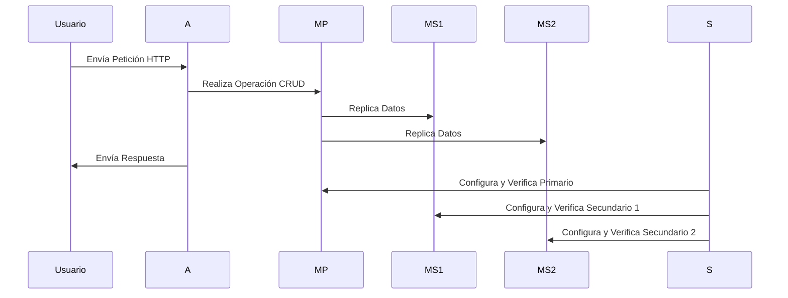

---

# DDBP

## Introducción

DDBP es un proyecto conceptual de redes sociales a pequeña escala diseñado para administrar un conjunto réplica de MongoDB utilizando Rust. El proyecto aprovecha tecnologías modernas para asegurar operaciones robustas, escalables y eficientes para una plataforma de redes sociales. Automatiza la configuración y la administración de un conjunto réplica de MongoDB para proporcionar alta disponibilidad, fiabilidad y tolerancia a fallos para los datos de usuario, publicaciones e interacciones.

---

## Stack

El proyecto utiliza las siguientes tecnologías y herramientas:

### Tecnologías Centrales
- **Rust**:  
  El lenguaje de programación principal, elegido por su alto rendimiento, seguridad de memoria y fiabilidad.
- **Shell**:  
  Usado para scripting para automatizar la configuración, la configuración y el mantenimiento del conjunto réplica de MongoDB.
- **MongoDB**:  
  La base de datos NoSQL utilizada para almacenar y administrar datos con alta flexibilidad y escalabilidad.

### Orquestación y Contenedores
- **Podman**:  
  Una herramienta de administración de contenedores utilizada para ejecutar instancias de MongoDB en entornos aislados, consistentes y escalables.

### Seguridad y Autenticación
- **OpenSSL**:  
  Utilizado para generar archivos de clave para la autenticación del conjunto réplica de MongoDB, asegurando la comunicación segura entre nodos.

---

## Dependencias

El proyecto Rust depende de las siguientes dependencias clave:

- **Funcionalidad Central**
  - `mongodb`: Controlador de MongoDB para Rust.
  - `actix-web`: Un framework web asíncrono de alto rendimiento para construir APIs.
  - `tokio`: El runtime asíncrono para Rust, que permite I/O y concurrencia no bloqueantes.

- **Manejo de Datos**
  - `serde` y `serde_json`: Para la serialización y deserialización de datos.
  - `uuid`: Genera identificadores únicos para documentos de la base de datos.

- **Utilidades**
  - `dotenv`: Carga variables de entorno desde un archivo `.env`.
  - `chrono`: Administra operaciones de fecha y hora.
  - `tracing` y `tracing-subscriber`: Proporciona registro y tracing para depuración y monitorización.

---

## Descripción del Proyecto

El proyecto DDBP está diseñado para configurar y administrar un conjunto réplica de MongoDB para una plataforma de redes sociales a pequeña escala. Combina la programación en Rust con scripting de Shell para automatizar la configuración, la configuración y el mantenimiento del conjunto réplica de MongoDB. El objetivo es asegurar alta disponibilidad, fiabilidad y escalabilidad para las necesidades de almacenamiento de datos de la plataforma.

### Características Clave
- Configuración automatizada de un conjunto réplica de MongoDB con un nodo primario y dos nodos secundarios.
- Monitorización y verificación del estado del conjunto réplica.
- Comunicación segura entre instancias de MongoDB utilizando autenticación.
- Instancias de MongoDB en contenedores para entornos aislados y consistentes.
- Arquitectura escalable para manejar datos de usuario, publicaciones e interacciones.

---

### ER

---
### Cómo Funciona

El proyecto integra varios componentes para lograr sus objetivos:

1. **Scripts de Shell**  
   - `start.sh`:  
     - Limpia los contenedores de MongoDB existentes.  
     - Crea una red personalizada para las instancias de MongoDB.  
     - Configura el conjunto réplica con un nodo primario y dos nodos secundarios.  
     - Verifica la configuración y proporciona la cadena de conexión.
   - `check_replica_set.sh`:  
     - Se conecta a la instancia primaria.  
     - Verifica el estado del conjunto réplica y asegura que todos los nodos estén saludables.

2. **Código Rust**  
   - Implementa un servidor web utilizando `actix-web` para manejar peticiones HTTP.  
   - Proporciona operaciones CRUD para datos de usuario, publicaciones e interacciones.  
   - Administra la comunicación con el conjunto réplica de MongoDB.

3. **Contenerización con Podman**  
   - Las instancias de MongoDB se ejecutan en contenedores aislados.  
   - Se crea una red personalizada para permitir la comunicación entre los nodos de MongoDB.

4. **Seguridad**  
   - Utiliza OpenSSL para generar un archivo de clave para la autenticación del conjunto réplica de MongoDB.  
   - Asegura la comunicación segura entre instancias de MongoDB.

---

### Arquitectura del Sistema

El siguiente diagrama ilustra la arquitectura del proyecto DDBP:



---

### Flujo de Operación

El siguiente diagrama de secuencia ilustra el flujo de operaciones dentro del proyecto DDBP:



---

## Uso

### Configuración del Conjunto Réplica de MongoDB

1. Para configurar el conjunto réplica de MongoDB, ejecuta el script `start.sh`:
   ```bash
   ./start.sh
   ```
   Este script hará lo siguiente:
   - Limpiará cualquier contenedor y pod de MongoDB existente.
   - Creará una red personalizada.
   - Configurará el conjunto réplica de MongoDB con una instancia primaria y dos instancias secundarias.
   - Verificará la configuración y proporcionará la cadena de conexión para el conjunto réplica.

2. Para verificar el estado del conjunto réplica, ejecuta el script `check_replica_set.sh`:
   ```bash
   ./check_replica_set.sh
   ```

---

## Conclusión

DDBP es un proyecto robusto y escalable que simplifica la administración de un conjunto réplica de MongoDB para una plataforma de redes sociales a pequeña escala. Al aprovechar el rendimiento y la seguridad de Rust, combinado con Podman para la contenerización y OpenSSL para la comunicación segura, el proyecto asegura una solución fiable, eficiente y tolerante a fallos para las operaciones de la base de datos.

Este proyecto proporciona una base sólida para construir una plataforma de redes sociales escalable y eficiente con alta disponibilidad y tolerancia a fallos.

---

## Resumen

- **Objetivo:** Automatizar la administración del conjunto réplica de MongoDB para una plataforma de redes sociales.
- **Pila Tecnológica:** Rust, MongoDB, Podman, OpenSSL.
- **Características Clave:** Alta disponibilidad, replicación, comunicación segura, contenerización.
- **Beneficios:** Escalable, tolerante a fallos, eficiente y fácil de mantener.
